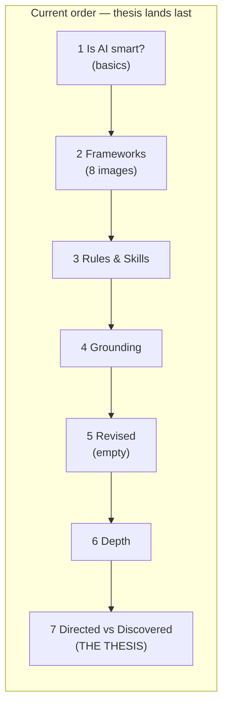
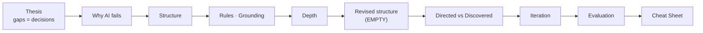

# Version 1

## Page by page notes

**Home (`index.html`)**
- *Working:* Clean, calm layout. Author/date framing is fine.
- *Unclear / weak:* This page does no work. There's no thesis, no agenda, no argument for why a room full of people who already use AI daily should keep reading. The lede — "the art of crafting precise and effective instructions for AI models" — is a beginner's definition. And the title **"Prompt Engineering 101"** actively signals "this is remedial" to a senior-director audience. You also have `.card-grid`/`.topic-card` styles sitting unused, so the homepage doesn't even surface the journey.
- *Suggestion:* Replace the generic lede with the actual thesis ("Every gap in your prompt is a creative decision you're handing to the AI — this is about choosing those gaps on purpose") and add a one-line agenda. Drop "101" from anything customer-facing.

**1 — Is AI smart?**
- *Working:* The wrong→right reveal interaction is a nice device.
- *Unclear / weak:* This is the most expendable page for *this* audience. "AI recognizes patterns, can make confident mistakes, treat it as a capable assistant not an all-knowing expert" is exactly what daily users already internalized 18 months ago. The wrong-answer screenshots prove a point they don't dispute. It opens the deck on a beginner note and undercuts your credibility with the directors in the room.
- *Suggestion:* If you keep it, flip the question from "is AI smart?" (they know) to "*why* does it fail predictably?" — i.e., it fills unspecified gaps with the statistically average answer. That reframing is the spine of your whole narrative and earns its place; "is it smart" doesn't.

**2 — General Prompt Structure**
- *Working:* The "Key Points" prose is the best writing in the deck — "they're a menu, not a checklist," "task first, always" is a genuinely good, opinionated take.
- *Unclear / weak:* Eight framework screenshots (CRISPE, the 6-step, the Claude anatomy…) is survey-course overload and reads as beginner content. The insight is buried *under* the noise. Worse, the body text says "The one I find most honest is this one **[image 4]**" — that's a broken reference. In a masonry grid the reader cannot tell which tile is "image 4." A visual you have to count to is a failed visual.
- *Suggestion:* Cut to one or two images, or replace all eight with a single synthesized diagram (skeleton = task/context/role/format; "muscle" = the optional levers). Lead with the "menu not a checklist" line, then show the visual that proves it. Never reference an image by number.

**3 — Rules and Skills**
- *Working:* Real, level-appropriate examples (WCAG reviewer, design-director critique, upstream-thinking partner). This is core "underused levers" content and it lands.
- *Unclear / weak:* The **Rules** examples are developer-centric (`console.log`, "LWC over Aura") while the audience is UX designers — that mismatch makes Rules feel like it's not for them, right before Skills nails the design framing. Also, it's pure definition→example with zero mechanics: *where* do these live, *how* does a designer actually persist a rule or skill in their tool? Senior people will ask "okay, so where do I put this?"
- *Suggestion:* Swap the dev rules for design-ops rules ("always check against our token library," "never invent component names outside SLDS"), and add one sentence on where rules/skills physically live in the tools they use.

**4 — Grounding**
- *Working:* The strongest page. Specific, concrete, immediately usable — config dump, Figma-to-SLDS mapping, decision log, session handoff note. This *adds value* beyond what they know.
- *Unclear / weak:* It's heavily Salesforce-specific. Fine if the audience is internal SF designers; if it's broader, half of it won't transfer. Also the "three questions" at the end (what exists / what I want / what I ruled out) is actually a mini-thesis that's stranded here instead of being a headline idea.
- *Suggestion:* Promote those three questions to a callout — they're more memorable than the file-type list. Flag explicitly if the audience isn't all-Salesforce.

**5 — Revised Prompt Structure**
- *Working:* Nothing yet. It's a single unexplained image.
- *Unclear / weak:* This is the worst page in the deck. The heading says "based on the **new components**" but there is zero prose telling the reader what changed, why, or how rules/skills/grounding/depth fold into the structure from page 2. This is supposed to be the *payoff* of the build — the moment the levers snap into the skeleton — and it's blank. A senior audience gets nothing from an unannotated diagram.
- *Suggestion:* This page needs the most work. Write the synthesis: "Page 2 was the skeleton. Here's the same structure with the levers added — and here's what each one buys you." Annotate the image or rebuild it with callouts.

**6 — Prompt Depth**
- *Working:* The Quick/Standard/Deep model is a clean mental model, and "if you don't set depth, the AI guesses how much work to do" ties to the thesis.
- *Unclear / weak:* It dangerously overlaps with page 7. Depth ("how much thinking") and specificity ("how much direction") are different axes, but the deck never distinguishes them, so they read as the same idea told twice. The examples ("give me the short version first") are also the most basic on any topic page.
- *Suggestion:* Explicitly contrast the two axes ("depth = effort; specificity = direction; you set both"), or merge this into page 7 as a second dimension. Right now it feels like filler between Grounding and the payoff.

**7 — Directed vs. Discovered**
- *Working:* Your best conceptual content. The barista metaphor is excellent, the four levels are well-written, and three worked examples (research synth, design critique, login page) are exactly the right altitude. The tabs are a good interaction.
- *Unclear / weak:* It's **last**, but it's actually your thesis — "every gap is a creative decision; choose your specificity on purpose." Burying the organizing idea at the end means everything before it had no frame to hang on. Also: the tab/file title still says "Guessing vs Specifics" (`<title>` and filename) while the H1 says "Directed vs. Discovered" — pick one. And there's a stray closing `"` after the login example.
- *Suggestion:* This idea should frame the deck near the front, then the structure/levers pages explain *how* to control the gaps. At minimum, fix the title mismatch and the stray quote.

## Flow assessment

The story does **not** hold together as currently ordered, because the thesis arrives last. Right now the arc is: *what AI is → here are frameworks → here are some levers → here's a revised structure (blank) → depth → oh, and by the way, specificity is a choice.* The single most powerful idea you have — gaps are decisions you're making whether you notice or not — is the finale instead of the lens.

Momentum dies in two specific places:
1. **Page 1 → 2:** you open on basics they know, so you start in a hole.
2. **Page 4 → 5:** Grounding builds real energy, then page 5 (the supposed payoff) is empty, so the "we've been building toward something" promise breaks. After that, 6 and 7 feel like appended extras rather than a climax.



A stronger spine: open with the thesis (gaps = decisions), then specificity/depth as the two dials, then the levers (grounding, rules, skills) as *how you fill the gaps you chose to fill*, then a real synthesized structure as payoff, then a takeaways page.

## Gaps

- **No opening thesis / agenda.** The narrative thread you described in the brief never appears on the site.
- **No payoff page.** Page 5 should be the synthesis and it's blank — the biggest structural hole.
- **Iteration & recovery is missing entirely.** Daily users spend most of their time *correcting* a first answer, not crafting one perfect prompt. There's nothing on how to course-correct, what to add when output drifts, or when to restart vs. refine.
- **Output evaluation is missing.** Page 1 asserts "give it a way to verify the result," then the deck never returns to *how* to evaluate or pressure-test output.
- **The cost of over-specifying is unaddressed.** Page 7 hints that surprise has value, but you never warn that over-constraining kills the AI's good ideas. For senior people, knowing *when to leave gaps open* is the more sophisticated lesson.
- **No connective tissue between pages.** Each page is an island — no callbacks, no "previously / next," no recap. The reader has to assemble the argument themselves.

## What to cut

- **"Prompt Engineering 101" as a title** — it signals remedial to directors.
- **Page 1 in its current form** — the "is AI smart / it makes mistakes / treat it as an assistant" content is below this audience. Reframe to "why it fails predictably" or cut.
- **Six of the eight framework screenshots on page 2.** They add survey-course noise and bury your one good insight.
- **"Prompt Depth" as a standalone topic** if you can fold it into the specificity discussion — as-is it reads as a near-duplicate of page 7.
- The generic homepage meta tone ("the art of crafting precise and effective instructions").

## What to add

- **An opening thesis page** that states the four-part argument from your brief outright. Give the directors the "so what" in the first 20 seconds.
- **A real "Revised Structure" payoff** — annotated, showing how grounding/rules/skills/depth attach to the task/context/role/format skeleton. This is the page that justifies the whole build.
- **An "Iteration & Recovery" page** — how to diagnose why output missed, what to add, refine-vs-restart. This is where daily users actually live.
- **An "Evaluating Output" page** — closing the loop you opened on page 1: how to make the AI critique its own work, and how to spot confident-but-wrong.
- **The over-specification trade-off** — a senior-level nuance: when leaving the gap open produces better work than directing it. This is the idea that separates "I write detailed prompts" from "I choose my altitude on purpose."
- **A closing takeaways / cheat-sheet page** — the deck currently just stops. Give them the one card they screenshot and keep.
- **A short note on reasoning/thinking modes and model choice** — for a daily-using audience, "when to spend the extra latency on extended thinking" is current and credible in a way "is AI smart" is not.

The raw material on pages 3, 4, and 7 is genuinely strong and above the bar for this audience. The problem is architectural: your best idea is hidden at the end, your payoff page is empty, and you open on content these people mastered a year ago. Fix the order and fill page 5, and this goes from "decent intro deck" to something a senior director would actually take notes on.

---

# Version 2

## Page by page notes

**Home (`index.html`)**
- *Working:* The lede now does real work — "Every prompt has gaps. The AI fills them all, every time, without asking" is the thesis, stated plainly. Calm, confident tone that respects the audience.
- *Unclear:* The agenda heading is misspelled "Ageda." The date (June 17) doesn't match the export's June 8. And there's a branding split across the whole site: this page is "Prompting with Intent," but topic pages 1–8 still title themselves "Prompt Engineering 101" and the sidebar wordmark reads "Prompt Engineering." Three names for one site.
- *Suggestion:* Fix "Ageda," then do one global find-replace so every page, `<title>`, and wordmark says "Prompting with Intent." The "101" still lingering in tab titles is the exact remedial signal you removed from the front door.

**Thesis (`1-lets-go-on-a-trip.html`)**
- *Working:* This is the right opener. "Every gap in your prompt is a creative decision you are handing to the AI" is the spine, and "Gaps are decisions" is the best section title in the deck.
- *Unclear:* The seven topic-card links are all broken. They point to `topics/1-is-ai-smart.html`, `topics/2-general-prompt-structure.html`, etc. — old filenames, and because this page already lives in `/topics/`, the relative path resolves to `/topics/topics/...`. They also describe a stale 7-page structure that omits Iteration, Output Evaluation, and the Cheat Sheet.
- *Suggestion:* Rewrite the card grid against the actual current files/titles, or cut it and let the sidebar carry navigation. A broken "what you'll learn" map on page one is the worst place for dead links.

**1 — Why AI Fails Predictably?**
- *Working:* The hero reframe is exactly right for this audience: "AI does not fail randomly… missing context, not missing intelligence." That earns its place where "Is AI smart?" did not.
- *Unclear:* The body didn't follow the hero. The section is still called "Some Examples" and still opens "AI is smart at some tasks and limited at others… it can make confident mistakes" — the old beginner copy the hero just promised to move past. And the wrong→right screenshots are never explained: what was the prompt, what was the gap, why did "checking" fix it? The visual carries the whole section but has no caption tying it to the thesis.
- *Suggestion:* Rewrite the body to match the hero — name a specific gap and show the screenshot as proof of that gap being filled wrong. Retitle "Some Examples" to something like "The same gap, three models."

**2 — General Prompt Structure**
- *Working:* "They're not a checklist, they're a menu. Your job is knowing which items your task actually needs" is still the sharpest line in the deck.
- *Unclear:* Two real defects. (1) The "[image 4]" reference is still in the first paragraph — a broken pointer the reader can't resolve in a masonry grid. (2) That first `<p>` contains the entire essay, and then the next three `<p>` tags repeat the same three points almost verbatim — it reads like a draft and a rewrite were both left in. Eight framework screenshots is also still survey-course overload that buries the insight.
- *Suggestion:* Delete the long first paragraph (the one with "[image 4]") and keep the cleaner three that follow. Cut to one or two images, or one synthesized skeleton/muscle diagram. Never reference an image by number.

**3 — Rules and Skills**
- *Working:* Now genuinely design-oriented (SLDS naming, "flag accessibility before visual changes," the design-director and upstream-thinking skills). And you added where they live — Project instructions, `.cursorrules`, system prompt — which is the mechanics senior people ask for. Strong page.
- *Unclear:* "Rules govern every response" and "Skills activate a mode of thinking" are dropped in as orphan one-liners with no connection. The `<ul>` is nested inside a `<p>`, which is invalid markup. Minor: `.cursorrules` is the legacy form (`.cursor/rules/*.mdc` is current).
- *Suggestion:* Fold those two orphan lines into a single contrast sentence ("Rules govern every response; skills change how it thinks when invoked") and move it up as the framing for the page.

**4 — Grounding**
- *Working:* Still the most concrete, immediately usable page — config dump, Figma-to-SLDS mapping, decision log, session handoff. This is where you add the most value.
- *Unclear:* Heavily Salesforce-specific with no flag that it's an example domain. And the "three questions" (what exists / what I want / what I ruled out) are buried as the last bullet — they're really a portable mini-thesis (and you've since promoted them to the Cheat Sheet, which proves the point).
- *Suggestion:* Pull the three questions into a callout at the top of the page and say "this transfers to any domain; the file list below is the Salesforce version."

**5 — Prompt Depth**
- *Working:* The depth-vs-specificity distinction paragraph is a real improvement — "You can write a highly specific prompt and still get a shallow answer… They are separate dials." Quick/Standard/Deep with the WCAG examples is clean and level-appropriate.
- *Unclear:* That distinction paragraph references "specificity" as a known concept, but specificity (Directed vs. Discovered) isn't introduced until two pages later — a forward reference the reader can't cash. It also sits in a headingless `content-section`, so it reads like a floating aside.
- *Suggestion:* Give it an `<h2>` ("Depth is not specificity") and either move Directed vs. Discovered adjacent to this page, or add one line: "We'll cover the specificity dial next."

**6 — Revised Prompt Structure**
- *Working:* Honestly, nothing yet — this is still the weakest page and was flagged as such before.
- *Unclear:* It is still a single unexplained image. The heading promises "based on the new components" but there is zero prose explaining what changed or how grounding/rules/skills/depth snap onto the task/context/role/format skeleton from page 2. This is the structural payoff of the entire build, and it's blank.
- *Suggestion:* This page needs the most work of any in the deck. Write the synthesis: "Page 2 was the skeleton. Here's the same structure with the levers added, and here's what each one buys you." Annotate the image with callouts, or it doesn't earn being the climax.

**7 — Directed vs. Discovered**
- *Working:* Your best conceptual content. The barista metaphor, the four well-written levels, three worked examples at the right altitude, and the new "A note on over-specifying" section (which closes a real gap — knowing when to leave a gap open is the senior-level lesson). The tabs are a good interaction.
- *Unclear:* The `<title>` still says "Guessing vs Specifics" while the filename is `8-directed-vs-discovered.html` and the H1 is "Directed vs. Discovered" — three names again. And the stray closing `"` after the login example (end of the fully-specified prompt) is still there.
- *Suggestion:* Fix the `<title>` and delete the orphan quote. Two-minute fixes on otherwise the strongest page.

**8 — Iteration & Recovery**
- *Working:* Excellent, high-value addition. "Getting a bad output isn't a failure, it's information." The three failure modes map cleanly back to the thesis (unclear task / missing context / wrong depth), and "summarize what the AI currently thinks you want — if that's wrong, restart" is a genuinely good test daily users will adopt.
- *Unclear:* Nothing significant. The `<ul>`-inside-`<p>` markup recurs here.
- *Suggestion:* Add one callback line ("these three failures map to the three dials you just learned") to make the connective tissue explicit.

**9 — Output Evaluation**
- *Working:* Strong and current. "Ask it to list its assumptions — that list is usually where the problems are" and the wrong vs. useless distinction ("useless output passes a quick read and costs you time later") are exactly the sophistication this audience respects. Good that it loops back to grounding.
- *Unclear:* Order — this arrives after Iteration & Recovery, but evaluating output is logically what you do before deciding to iterate. The sequence is reversed.
- *Suggestion:* Swap the two: Output Evaluation (how to judge it) → Iteration & Recovery (what to do when it's wrong).

**Closing — Cheat Sheet**
- *Working:* The right way to end. "Three questions before you type," the two dials, the underused levers, the recovery prompt — it's the one card someone screenshots. "If you can't answer all three, you're not ready yet" is a great closer.
- *Unclear:* It's filed as `9-cheat-sheet.html` and sits numerically before pages 10/11, so the file numbering no longer matches reading order. Cosmetic, but confusing for anyone editing.
- *Suggestion:* Leave the nav as-is (it reads correctly); just be aware the filename numbers are now decorative.

## Flow assessment

The arc is dramatically stronger than the structure the old feedback described. Putting the thesis first fixes the single biggest problem — every later page now has a frame to hang on. The current spine reads well:



Momentum still dies in two predictable spots:

1. **Depth (5) → Revised Structure (6).** You build through the levers, then hit the payoff page and it's a blank image. The "we've been building toward something" promise breaks at the exact moment it should pay off — same failure as the prior version.
2. **The two dials are split.** Depth (5) and Directed vs. Discovered (7) are the matched pair ("effort" and "direction"), but the empty Revised Structure page is wedged between them, so the reader never feels them as one idea with two knobs.

And the closing trio is slightly out of order: you teach how to recover (Iteration) before how to judge (Evaluation), when judging logically comes first.

## Gaps

- **The payoff page is still empty.** Revised Prompt Structure is the structural hole — the whole "skeleton + levers" build resolves to an unannotated PNG.
- **Visuals lack captions throughout.** The wrong/right model screenshots (page 1), the eight frameworks (page 2), and the revised structure (page 6) all carry argumentative weight with no text telling the reader what to take from them.
- **No connective tissue between pages.** Each page is still an island — no "previously / next," no callbacks. The thesis page tries to be the map but its links are broken, so nothing stitches the argument together for the reader.
- **The thesis page's own roadmap is dead** (broken links + stale page list), so the promised through-line isn't navigable from where it's introduced.

## What to cut

- **"Prompt Engineering 101" from every remaining `<title>` and wordmark.** You already rebranded the home page; the topic pages didn't get the memo.
- **The duplicated paragraph block on page 2** (the long first `<p>` containing "[image 4]"). It's a leftover draft sitting on top of the cleaner rewrite.
- **Six of the eight framework screenshots on page 2.** Still survey-course noise burying your one good insight.
- **The old beginner copy in page 1's body** ("AI is smart at some tasks and limited at others… confident mistakes") — it contradicts the reframed hero right below it.

## What to add

- **Real prose on the Revised Structure page** — the synthesis showing how grounding, rules, skills, and depth attach to the task/context/role/format skeleton, with annotated callouts on the diagram. This is the one page that justifies the entire build, and it's the highest-leverage thing you can write.
- **Captions/context for the three image-driven pages** — one line each: what the screenshot proves, which tile actually is the "honest" framework (by name, not number), what's different in the revised structure.
- **A working roadmap** — fix the thesis-page cards to the real files, and add a one-line "next:" pointer at the bottom of each page so the argument is navigable, not just adjacent.
- **One sentence on reasoning/thinking modes and model choice** — for a daily-using audience, "when extended thinking is worth the latency" is current and credible, and it's the natural companion to the Depth page.

The bones are now genuinely good — the thesis-first order, the over-specification nuance, and the Iteration/Evaluation/Cheat Sheet additions are exactly what a senior-director audience needs. What's left is mostly execution debt from the restructure: broken links, a stale roadmap, three different site names, a leftover draft paragraph, a stray quote, and the one page that was always meant to be the climax still sitting empty. Fill page 6 and clean up those defects, and this crosses from "solid internal deck" into something people will actually screenshot and reuse.


# Version 3

**Context:** This is a live presentation for internal Salesforce designers (junior to senior director level). The audience already uses AI daily. May be converted to self-guided website later. This review focuses on content only.

## Page by page notes

**Home (`index.html`)**
- *Working:* The lede has real weight. "Every prompt has gaps. The AI fills them all, every time, without asking" — this respects the audience and lands the thesis immediately. The agenda is tight and concrete.
- *Problems:* None for the presentation. Date is fine.
- *One fix:* If converting to self-guided later, remove the date or change to "Last updated."

**Thesis (`1-lets-go-on-a-trip.html`)**
- *Working:* "Gaps are decisions" is outstanding framing. Roadmap cards work and all links are correct. For a presentation, this gives people a map to reference.
- *Problems:* Missing bridging paragraph between thesis and cards. You'll say it verbally in the presentation, so not blocking. But adding one paragraph ("The pages that follow build one idea at a time: why gaps get filled wrong, what structure to use, which levers most people miss") gives you a smoother verbal transition.
- *One fix:* Add bridging paragraph only if you want the smoother transition. Optional.

**Why AI Fails Predictably? (`2-why-ai-fails.html`)**
- *Working:* Hero copy is excellent: "missing context, not missing intelligence." Right reframe for internal designers.
- *Problems:* Body contradicts the hero. Lines 49-54: "AI is smart at some tasks and limited at others... it can make confident mistakes" — this is beginner-level framing your audience mastered a year ago. The hero elevates, then the body walks it back. The screenshot interaction is good, but zero explanation of what the gap was. You'll probably say it verbally, but the slide doesn't connect screenshots to thesis.
- *One fix:* Delete lines 49-54. Replace with: "When you ask 'how many Rs are in strawberry,' all three major models confidently answer wrong. The gap: you didn't tell them to count carefully or verify. Add that instruction and they all get it right. Same model, same question, different gap."

**General Prompt Structure (`3-general-prompt-structure.html`)**
- *Working:* "They're not a checklist, they're a menu" — strongest conceptual line. Good writing.
- *Problems:* Eight framework screenshots is overload for a live presentation. You'll either rush through (nobody absorbs eight diagrams in 30 seconds) or spend time on them (buries your point). Your insight is buried beneath visual noise. Key Points says "the one I find most honest" but never says which image that is — you can't point in a masonry grid.
- *One fix:* Option A: Cut to 2-3 frameworks. Option B: Add ONE clean skeleton visual first (task/context/role/format), then say "these eight all agree on this," then show eight as evidence.

**Rules and Skills (`4-rules-and-skills.html`)**
- *Working:* Perfect for internal SF designers. SLDS naming, accessibility flags, design-director critique. Right altitude. "Where they live" mechanics included. Strong page.
- *Problems:* Two orphan one-liners (lines 61, 87): "Rules govern every response" / "Skills activate a mode of thinking" appear as standalone tags with no context. In a presentation, these look like placeholder text.
- *One fix:* Combine into one framing sentence: "Rules govern every response; skills change how the AI thinks when invoked." Put at top of page after hero.

**Grounding (`5-grounding.html`)**
- *Working:* Your strongest page. Concrete, immediately actionable, Salesforce-specific in exactly the right way. Config dumps, Figma-to-SLDS, SLDS library, navigation model, decision logs — precisely what internal SF designers need. Three questions properly elevated. Perfect for this audience.
- *Problems:* None. This page is done. Do not genericize it.
- *One fix:* None needed.

**Directed vs. Discovered (`6-directed-vs-discovered.html`)**
- *Working:* Strongest conceptual content. Barista metaphor excellent. Four levels well-written. Three tabbed examples at right altitude. Over-specifying section is the senior-level nuance. This is the screenshot page.
- *Problems:* Over-specifying section (lines 260-268) arrives after examples, reading like an afterthought. It's actually the thesis — "knowing when to leave gaps open." In a presentation, you want that up front so four levels read as "here's how to control the dial."
- *One fix:* Move over-specifying section to right after hero, before tabs. That frames the page correctly.

**Prompt Depth (`7-prompt-depth.html`)**
- *Working:* Depth-vs-specificity distinction clear: "They are separate dials. You control both." Quick/Standard/Deep model clean and appropriate.
- *Problems:* Distinction paragraph sits in un-headed section, feels like aside. Could add one line about reasoning modes/model choice ("Depth also includes choosing the right model — quick tasks don't need reasoning models") to show you're current. Not blocking.
- *One fix:* Add `<h2>` at line 55: "Depth is not specificity." Add callback line at end: "You just learned specificity (direction) on the previous page. This is depth (effort). Two dials. Set neither, AI guesses both."

**Revised Prompt Structure (`8-revised-prompt-structure.html`)**
- *Working:* Real prose now. Nine-component breakdown clear, well-organized, properly tiered. "What it does / Why it breaks" immediately scannable. "Set once, use always" callout is practical wisdom. Legitimate payoff page.
- *Problems:* Prose is good but no synthesized visual. For a presentation, a diagram showing "skeleton + levers" is the slide someone photographs. Table works but doesn't stick. Simple annotated diagram (task/context/role/format with grounding/rules/skills/depth attached) becomes the one-card summary people keep.
- *One fix:* Add synthesized diagram if you have an hour. If not, prose table works for live presentation. Prioritize if converting to self-guided later.

**Cheat Sheet (`9-cheat-sheet.html`)**
- *Working:* Perfect closing page. Tight, scannable, usable. "If you can't answer all three, you're not ready yet" — strong closer. This is the screenshot slide.
- *Problems:* None.
- *One fix:* None needed.

**Output Evaluation (`10-output-evaluation.html`)**
- *Working:* Strong, sophisticated. "Ask it to list assumptions — that list is usually where problems are" and wrong-vs-useless distinction are insights internal designers haven't seen. Evaluation prompt immediately usable.
- *Problems:* Arrives after Iteration (page 11), but logically you evaluate before iterating. Sequence backward. Get output → judge it (Evaluation) → decide what to do (Iteration). For teaching a mental model, sequence matters.
- *One fix:* Swap filenames so Evaluation is 10, Iteration is 11. Nav auto-updates. 2-minute fix, high pedagogical value.

**Iteration & Recovery (`11-iteration-and-recovery.html`)**
- *Working:* Excellent. "Getting bad output isn't failure, it's information." Three failure modes clean. Refine-vs-restart test genuinely good. Recovery prompt usable.
- *Problems:* Only sequencing (see Evaluation above).
- *One fix:* After swapping order, add callback: "These map directly to the three core components: task, grounding, depth. If you set them clearly, most failures don't happen."

## Flow assessment

Arc is strong for a live presentation. Thesis-first, levers in middle, synthesis as payoff, recovery sequence, cheat sheet closer.

Current order:
```
Home → Thesis → Why AI Fails → Structure → Rules/Skills → Grounding → 
Directed vs Discovered → Depth → Revised Structure → Cheat Sheet → Evaluation → Iteration
```

**One real problem:** Evaluation and Iteration backward. Pedagogical sequence: get output → evaluate (is it right?) → iterate (what do I do?). Current order teaches iteration before evaluation.

Correct order:
```
Home → Thesis → Why AI Fails → Structure → Rules/Skills → Grounding → 
Directed vs Discovered → Depth → Revised Structure → Evaluation → Iteration → Cheat Sheet
```

Swap files 10↔11, Cheat Sheet moves to end.

## Gaps

- **Evaluation and Iteration sequenced backward** — evaluate (diagnostic) then iterate (treatment).
- **"Why AI Fails" concept gap between hero and body** — hero sophisticated, body beginner-level. Screenshots need prose tying them to "gaps are decisions."
- **No visual synthesis on Revised Structure** — prose table good, but diagram showing "skeleton + levers" would be memorable takeaway.
- **General Structure buries insight under eight frameworks** — insight is "menu not checklist," eight screenshots should be supporting evidence, not primary content.
- **Over-specifying section trails examples** — it's page thesis but arrives last.

## What to cut

- **"Some Examples" body text on page 2** (lines 49-54) — beginner framing contradicting sophisticated hero
- **Five or six frameworks on page 3** — OR add skeleton visual first so eight become evidence
- **`.cursorrules (older versions)` reference on page 4** — document current tooling for mid-2026 audience
- **Orphan one-liners on page 4** (lines 61, 87) — combine into framing sentence

## What to add

**Mandatory for presentation:**
1. **Swap Evaluation/Iteration order** (2 min - rename files 10↔11)
2. **Fix page 2 body text** (5 min - delete beginner copy, add paragraph tying screenshots to thesis)
3. **Move over-specifying section to top of page 6** (2 min)
4. **Fix orphan one-liners on page 4** (2 min)

**High-value but not blocking:**
5. **Add skeleton visual to page 3 or cut to 2-3 frameworks** (20 min)
6. **Add synthesized diagram to page 8** (1 hour - this is the slide people photograph)
7. **Add `<h2>` and callback on page 7** (5 min - makes two-dials concept explicit)

**For self-guided conversion later:**
- Bridging paragraph on thesis page
- Connective tissue throughout
- One line on reasoning modes/model choice

## What's actually good

**Grounding page is exceptional.** Salesforce-specific in exactly the right way. Content internal designers use Monday morning. Specificity is the value.

**Directed vs Discovered conceptually excellent.** Barista metaphor, four levels, over-specifying nuance — senior directors will reference this.

**Thesis-first structure correct.** "Gaps are decisions" opens and builds from there.

**Iteration and Evaluation are high-value.** "Bad output is information" and "wrong vs. useless" reflect how daily users work.

**Cheat Sheet is real closer.** Distills parts worth keeping, not just summary.

**Writing consistently strong.** "Menu not checklist." "AI guesses if you don't set depth." "Knowing which gaps to close." Right register.

## Bottom line

This is a **strong internal presentation** for Salesforce design teams. Not remedial, respects audience, has genuinely new ideas (three questions, two dials, wrong vs. useless, 14 grounding resources).

To make it **the reference presentation on prompt engineering for designers**, fix three things:

1. **Swap Evaluation/Iteration order** — 2 min, high pedagogical value
2. **Fix page 2 body text** — 5 min, elevates sophistication immediately  
3. **Move over-specifying to top of page 6** — 2 min, frames page correctly

**Bonus if you have time:** Add synthesized diagram to page 8 — the one slide people photograph. 1 hour.

The raw material is strong. You're closer than you think.
